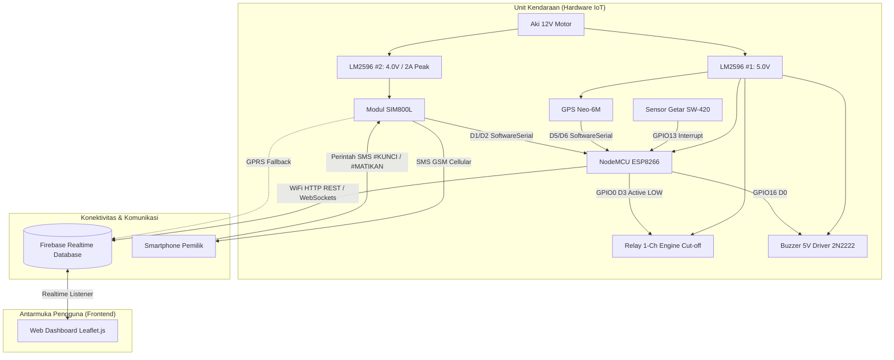
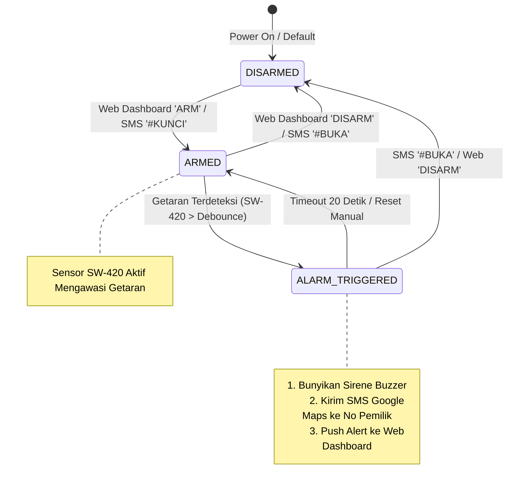

# Dokumentasi Desain Sistem & Arsitektur Teknis IoT
## Sistem Keamanan & Pelacak Kendaraan Cerdas (ESP8266 + GPS + GSM)

Dokumen ini menjelaskan arsitektur perangkat keras, diagram alir *state machine*, protokol komunikasi AT command SIM800L, format REST API Firebase, serta mekanisme *failover* jaringan.

---

## 1. Arsitektur Tingkat Tinggi (High-Level Architecture)



---

## 2. State Machine Sistem Keamanan



---

## 3. Diagram Sekuens: Deteksi Pencurian & Notifikasi Darurat

```mermaid
sequenceDiagram
    autonumber
    actor Pencuri as Pencuri / Guncangan Fisik
    participant SW as Sensor SW-420
    participant ESP as ESP8266 Controller
    participant GPS as GPS Neo-6M
    participant Act as Buzzer & Relay
    participant GSM as Modul SIM800L
    participant FB as Firebase RTDB
    participant Web as Web Dashboard
    participant Owner as HP Pemilik

    Pencuri->>SW: Mengguncang / Memindahkan Kendaraan
    SW->>ESP: Trigger Digital Interrupt (GPIO13 LOW/HIGH)
    
    rect rgb(40, 20, 20)
        ESP->>Act: Nyalakan Sirene Buzzer (Cadence Siren)
        ESP->>GPS: Ambil Koordinat Terakhir (Lat, Lng, Speed)
        GPS-->>ESP: Return -6.2088, 106.8456
        
        ESP->>GSM: AT+CMGS="+6281234..." (Pesan SMS Darurat + Link Maps)
        GSM->>Owner: SMS Terkirim: "Getaran terdeteksi! maps.google.com/?q=..."
        
        ESP->>FB: PATCH /vehicles/vehicle_01/status (theft_alert: true)
        FB->>Web: Event Update Real-Time
        Web->>Web: Bunyikan Sirene Browser & Tampilkan Modal Darurat
    end
    
    Owner->>GSM: Balas SMS: "#MATIKAN"
    GSM->>ESP: +CMT: "#MATIKAN"
    ESP->>Act: Aktifkan Relay D3 (Putus Pengapian CDI)
    Act-->>ESP: Mesin Terkunci (Cut-Off)
    ESP->>GSM: Kirim Balasan SMS: "Mesin telah diputus."
    GSM->>Owner: SMS Konfirmasi Diterima
```



---

## 4. Referensi Perintah AT Modul SIM800L

| Perintah AT | Parameter / Format | Fungsi & Deskripsi |
| :--- | :--- | :--- |
| `AT` | - | Pengujian komunikasi serial dasar. Respons: `OK`. |
| `ATE0` | - | Menonaktifkan *echo* karakter agar parsing serial lebih bersih. |
| `AT+CMGF=1` | Mode 1 (Text) | Mengatur format SMS ke mode teks (bukan PDU). |
| `AT+CNMI=2,2,0,0,0` | Direct Indication | Notifikasi SMS masuk dikirim langsung via Serial (+CMT). |
| `AT+CMGS="<NoHP>"` | Diikuti teks + ASCII 26 (`0x1A`) | Mengirim pesan SMS ke nomor tujuan. |
| `AT+CSQ` | - | Memeriksa kualitas sinyal GSM (Rentang CSQ: 0 - 31). |
| `AT+CREG?` | - | Memeriksa registrasi SIM card di BTS seluler (1 = Home, 5 = Roaming). |
| `AT+COPS?` | - | Mendapatkan nama operator seluler yang sedang terhubung. |
| `AT+SAPBR=3,1,"APN","internet"` | Nama APN | Mengatur APN GPRS untuk koneksi internet. |
| `AT+SAPBR=1,1` | - | Mengaktifkan koneksi paket data GPRS. |
| `AT+HTTPINIT` | - | Menginisialisasi HTTP Service SIM800L. |
| `AT+HTTPPARA="URL","<URL>"` | URL Endpoint | Menentukan target URL HTTP GET/POST. |
| `AT+HTTPACTION=1` | 1 = POST, 0 = GET | Mengeksekusi permintaan HTTP melalui GPRS. |
| `AT+HTTPTERM` | - | Mengakhiri sesi HTTP untuk menghemat daya. |

---

## 5. Spesifikasi Payload Firebase Realtime Database

### 5.1 Telemetri (`/vehicles/{vehicle_id}/telemetry`)
```json
{
  "latitude": -6.208812,
  "longitude": 106.845621,
  "altitude": 18.5,
  "speed": 42.3,
  "heading": 65.0,
  "satellites": 10,
  "hdop": 1.1,
  "gps_fixed": true,
  "gsm_csq": 26,
  "gsm_signal_percent": 83,
  "gsm_network": "TELKOMSEL",
  "battery_voltage": 12.6,
  "power_source": "ACCU_12V",
  "vibration_detected": false,
  "engine_running": true,
  "connection_mode": "WIFI_ONLINE",
  "timestamp": 1786784000
}
```

### 5.2 Status & Kontrol (`/vehicles/{vehicle_id}/controls`)
```json
{
  "lock_engine": false,
  "armed": true,
  "trigger_panic": false,
  "find_vehicle": false,
  "emergency_sms_request": false,
  "reset_alarm": false,
  "last_command_time": 1786783990
}
```

---

## 6. Mekanisme Keandalan & Failover (Reliability)

1. **Jalur Utama (Primary Route - WiFi)**:
   - Menggunakan modul WiFi ESP8266 untuk komunikasi latency rendah (< 500ms) ke Firebase RTDB saat terkoneksi ke Hotspot / MiFi / WiFi rumah saat parkir.
2. **Jalur Darurat (Secondary Route - SMS GSM)**:
   - Jika koneksi WiFi terputus saat di perjalanan dan terjadi insiden pencurian, sistem mengalihkan transmisi sinyal darurat langsung via SMS seluler SIM800L.
   - SMS memiliki keunggulan tetap berfungsi meskipun kuota data internet habis atau sinyal 2G/GPRS lemah.
3. **Non-Blocking Watchdog & Scheduler**:
   - Seluruh eksekusi di `loop()` menggunakan timer `millis()` non-blocking tanpa fungsi `delay()` yang dapat menghambat respons serial GPS dan sensor getar.
