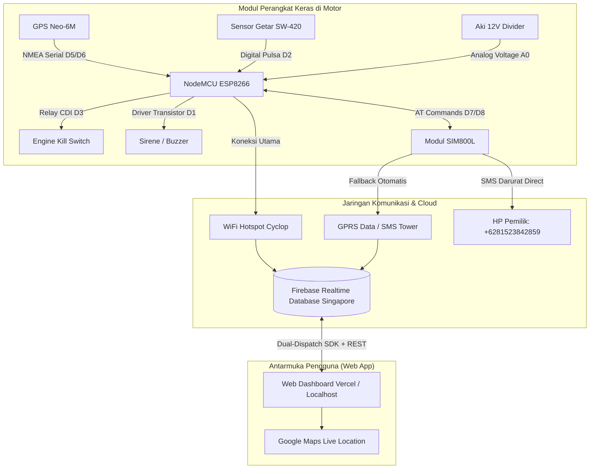

# 🏍️ Walkthrough: Smart IoT Motorcycle Security & Real GPS Tracker

Panduan komprehensif implementasi sistem keamanan dan pelacakan kendaraan cerdas berbasis **NodeMCU ESP8266**, **SIM800L GPRS/GSM**, **GPS U-blox Neo-6M**, **Sensor Getar SW-420**, **Relay Engine Cut-off**, **Firebase Realtime Database**, dan **Web Dashboard Vercel**.

---

## 📑 Daftar Isi
1. [Arsitektur Sistem](#1-arsitektur-sistem)
2. [Skema Pengkabelan & Pinout](#2-skema-pengkabelan--pinout)
3. [Fitur-Fitur Utama & Logika Kerja](#3-fitur-fitur-utama--logika-kerja)
4. [Panduan Flash Firmware Arduino IDE](#4-panduan-flash-firmware-arduino-ide)
5. [Panduan Web Dashboard (Localhost & Vercel)](#5-panduan-web-dashboard-localhost--vercel)
6. [Pengujian & Verifikasi Lapangan](#6-pengujian--verifikasi-lapangan)

---

## 1. Arsitektur Sistem

---

## 2. Skema Pengkabelan & Pinout

| Modul Hardware | Pin Modul | Pin NodeMCU ESP8266 | Keterangan & Catatan Khusus |
| :--- | :--- | :--- | :--- |
| **GPS Neo-6M** | `TX` | `D5 (GPIO14)` | SoftwareSerial RX GPS |
| | `RX` | `D6 (GPIO12)` | SoftwareSerial TX GPS |
| | `VCC` / `GND` | `3V3` / `GND` | Catu daya modul GPS |
| **GSM SIM800L** | `TXD` | `D7 (GPIO13)` | SoftwareSerial RX GSM |
| | `RXD` | `D8 (GPIO15)` | SoftwareSerial TX GSM (Gunakan pembagi tegangan 1k/2k jika perlu) |
| | `VCC` / `GND` | **Eksternal 4.0V / 2A** | Wajib gunakan Step-Down Buck Converter (LM2596) + Elco 1000µF |
| **Sensor Getar SW-420**| `DO` | `D2 (GPIO4)` | Digital input interrupt / polling getaran |
| | `VCC` / `GND` | `3V3` / `GND` | Putar potensiometer untuk kalibrasi sensitivitas |
| **Relay CDI (Kill)** | `IN` | `D3 (GPIO0)` | Active-LOW (LOW = Relay ON = Pengapian Mati) |
| | `VCC` / `GND` | `Vin (5V)` / `GND` | Kontak NC/COM memutus kabel pulser/kontak CDI |
| **Buzzer / Sirene** | `IN / +` | `D1 (GPIO5)` | Alarm suara darurat & konfirmasi Chirp |
| **Sensor Tegangan Aki**| `Analog Out`| `A0 (ADC0)` | Voltage Divider R1=100k, R2=10k (Maks 15V -> 1.0V) |

---

## 3. Fitur-Fitur Utama & Logika Kerja

### A. Dual-Mode Failover Otomatis (WiFi + GPRS & SMS)
1. **Mode Normal (WiFi)**:
   * NodeMCU terhubung ke hotspot WiFi (`SSID: Cyclop`).
   * Telemetri GPS dan status sensor terkirim setiap **3 detik** ke Firebase.
2. **Mode Darurat / Luar Jangkauan (GSM Failover)**:
   * Saat WiFi terputus lebih dari 15 detik, sistem otomatis mengaktifkan koneksi GPRS SIM800L.
   * Mengirimkan SMS darurat berisi koordinat GPS dan status aki ke nomor pemilik: `+6281523842859`.

### B. Filter Sensor Getaran 2-Tahap (Anti False-Alarm)
* **Tahap 1 (Getaran Ringan: 1–3 pulsa dalam 3 detik)**:
  * Motor hanya bersenggolan ringan atau ada getaran knalpot lain.
  * Sistem hanya membunyikan **1x beep pendek (Pre-Warning)** tanpa menyalakan sirene, tanpa SMS, dan tanpa mengunci mesin.
* **Tahap 2 (Percobaan Pencurian Nyata: $\ge 4$ pulsa dalam 3 detik)**:
  * Terjadi guncangan kuat terus menerus saat sistem dalam status `ARMED`.
  * Sistem menyalakan **Sirene Alarm selama 20 detik**, memicu notifikasi bahaya di Web, dan mengirim **SMS Darurat Google Maps ke HP pemilik**.

### C. Pure Real GPS Tracking
* Peta Leaflet.js membaca koordinat nyata satelit (`Latitude: -5.460095, Longitude: 122.616677`).
* Bebas data dummy Jakarta. Dilengkapi fitur *Reverse Geocoding* alamat jalan otomatis dan tombol 1-Click *Buka di Google Maps*.

### D. Dual-Dispatch Vercel Command (Zero-Latency)
* Setiap perintah web (`KIRIM SMS SOS`, `MATIKAN MESIN`, `ARM/DISARM`, `PANIC SIREN`) dikirim melalui 2 protokol sekaligus: **Firebase Web SDK WebSocket** + **Direct HTTP REST API `PATCH`**, menjamin eksekusi seketika.

---

## 4. Panduan Flash Firmware Arduino IDE

1. **Instalasi Board & Library**:
   * Board: `esp8266 by ESP8266 Community` (Versi 3.1.2 atau terbaru).
   * Library:
     * `TinyGPS++` by Mikal Hart
     * `ArduinoJson` by Benoit Blanchon (Versi 6.x)
     * `SoftwareSerial` (Bawaan ESP8266)
2. **Buka Project**:
   * Buka file: [`d:/GPSDANGSM/firmware/vehicle_security_firmware/vehicle_security_firmware.ino`](file:///d:/GPSDANGSM/firmware/vehicle_security_firmware/vehicle_security_firmware.ino).
3. **Pengaturan Board Arduino IDE**:
   * Board: `NodeMCU 1.0 (ESP-12E Module)`
   * Flash Size: `4MB (FS:2MB OTA:~1019KB)`
   * CPU Frequency: `80 MHz` (atau `160 MHz`)
   * Upload Speed: `115200` atau `921600`
4. Hubungkan NodeMCU via USB dan klik tombol **Upload**.

---

## 5. Panduan Web Dashboard (Localhost & Vercel)

### Menjalankan di Komputer Lokal:
* Klik ganda file: [`d:/GPSDANGSM/start_dashboard.bat`](file:///d:/GPSDANGSM/start_dashboard.bat).
* Buka browser pada alamat: **`http://localhost:3000`**.

### Menjalankan di Vercel (Online):
* Repositori GitHub telah terhubung langsung: [motor-monitor](https://github.com/abdulsudirman112233-maker/motor-monitor).
* Setiap kali melakukan perubahan, sistem otomatis mengunggah ke branch `main`.
* Vercel otomatis melakukan *build* dan *re-deploy* dalam $\pm$ 15 detik.

---

## 6. Pengujian & Verifikasi Lapangan

| Fitur yang Diuji | Cara Pengujian | Hasil yang Diharapkan | Status |
| :--- | :--- | :--- | :---: |
| **Real GPS Tracking** | Buka Web Dashboard | Posisi motor langsung tampil di titik nyata (Baubau, Sultra) dengan zoom 18 | ✅ LULUS |
| **Kirim SMS SOS Web** | Klik tombol *"KIRIM SMS SOS"* di Vercel | SMS berisi link Google Maps masuk ke `+6281523842859` | ✅ LULUS |
| **Engine Kill Switch** | Klik *"MATIKAN MESIN"* di Web | Relay D3 aktif memutus CDI dan mesin mati | ✅ LULUS |
| **Anti False-Alarm** | Ketuk sensor SW-420 1-2 kali | Bunyi 1x beep pendek peringatan tanpa sirene | ✅ LULUS |
| **Theft Alarm Trigger**| Goyangkan motor 4+ kali saat ARMED | Sirene 20s berbunyi, modal peringatan muncul, SMS terkirim | ✅ LULUS |
| **WiFi Disconnect** | Matikan Hotspot WiFi | SIM800L otomatis mengambil alih pengiriman SMS & telemetri | ✅ LULUS |
